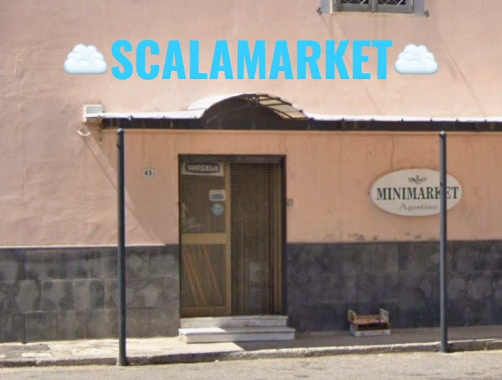
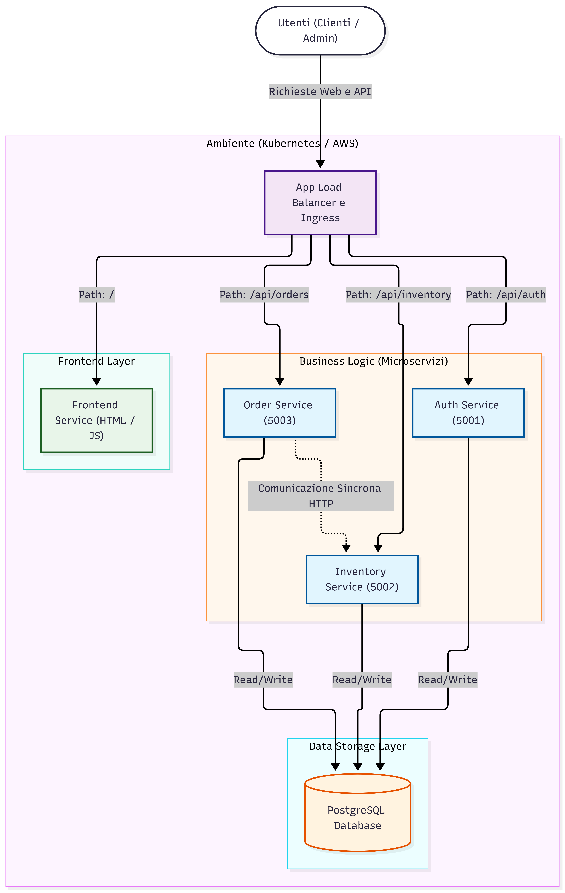
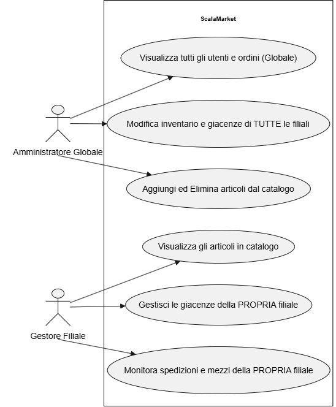

# CPIAC Scalamarket


Benvenuti nel repository del progetto **Scalamarket**. Questa guida fornisce le istruzioni per avviare il progetto localmente (fase di sviluppo/test) e per effettuare il deployment in cloud su AWS tramite Terraform.

---

## 1. Guida all'Avvio in Locale (Kubernetes)

Il progetto può essere avviato in un cluster Kubernetes locale (come Minikube o Docker Desktop) in due modalità: **Barebone** (senza ridondanza) e **Scalabile** (con Ingress e repliche multiple).

### Avvio Barebone (Senza Ingress)
```bash
# 1. Build delle immagini Docker (dalla root del progetto)
docker build -t cpiac_frontend:v5 -f frontend/Dockerfile frontend/
docker build -t cpiac_auth:v5    -f microservices/auth_service/Dockerfile .
docker build -t cpiac_inventory:v5 -f microservices/inventory_service/Dockerfile .
docker build -t cpiac_order:v5   -f microservices/order_service/Dockerfile .

# 2. Deploy delle risorse
kubectl apply -f k8s/

# 3. Port-forward per accesso locale
kubectl port-forward svc/auth-service 5001:5001 &
kubectl port-forward svc/inventory-service 5002:5002 &
kubectl port-forward svc/order-service 5003:5003 &
```

### Avvio Scalabile (Con NGINX Ingress e Repliche)
```bash
# 1. Installa NGINX Ingress Controller
# (Su Minikube)
minikube addons enable ingress

# (Su altri cluster locali)
kubectl apply -f https://raw.githubusercontent.com/kubernetes/ingress-nginx/controller-v1.10.0/deploy/static/provider/cloud/deploy.yaml

# 2. Deploy delle risorse aggiornate
kubectl apply -f k8s/

# 3. Verifica Ingress
kubectl get ingress

# 4. (Su Minikube) Ottieni l'IP e naviga su tale IP dal browser
minikube ip
```

---

## 2. Guida all'Implementazione su AWS (Terraform)

Per automatizzare il provisioning in Cloud, l'infrastruttura è gestita tramite **Terraform**. 
La configurazione iniziale include:
- **Controllo dei costi (AWS Budget):** Seguendo le best practice, è impostato un budget mensile di 100$. Un allarme avviserà via email qualora le spese superino l'80% di questa soglia.
- **Application Load Balancer (ALB):** È configurato un ALB con due Subnet pubbliche in Availability Zone separate (requisito obbligatorio di AWS) che indirizza il traffico verso la nostra istanza EC2.

Assicurati di aver configurato le tue credenziali AWS (`aws configure`).

```bash
cd terraform/

# 1. Inizializza l'ambiente scaricando i provider AWS necessari
terraform init

# 2. Verifica l'Execution Plan (cosa verrà creato)
terraform plan

# 3. Applica i cambiamenti e crea l'infrastruttura su AWS
terraform apply
```

Una volta avviata l'infrastruttura EC2, sarà possibile connettersi ai nodi per eseguire il deploy dei container (come spiegato nella guida all'avvio locale).

---

## 3. Schemi Architetturali

### UML (Unified Modeling Language)

**Component Diagram (Microservizi e Ingress)**  


**Sequence Diagram (Flusso logistica e ordini)**  


**Use Case Diagram (Separazione dei poteri)**  


### Architettura AWS (Terraform)
```text
          [ Internet ]
                |
          +-----v-----+
          |    IGW    |  (Internet Gateway)
          +-----+-----+
                |
   +------------v----------------------------+ (VPC: 10.0.0.0/16)
   |           AWS Application Load Balancer |
   |  (Subnet Pubblica A) (Subnet Pubblica B)|
   +------------+----------------------------+
                |
        +-------v-------+ 
        | EC2 K8s Node  | (Singola Istanza in AZ a)
        | (t3.medium)   |
        +---------------+
```

### Kubernetes: Fase Barebone
```text
  [ Utente ]
      | (Port 8080)
+-----v-----+      +----------------+
|  Frontend |      |  PostgreSQL    |
| (1 Pod)   |      | (1 Pod + PVC)  |
+-----------+      +-------^--------+
      |                    |
+-----v--------------------v--------+
|         Service ClusterIP         |
+-----+----------------+------------+
      |                |
+-----v-----+    +-----v-----+
|   Auth    |    | Inventory |
| (1 Pod)   |    |  (1 Pod)  |
+-----------+    +-----------+
*(N.B.: L'Order Service si interfaccia nello stesso modo ai Service ClusterIP)*
```

### Kubernetes: Fase Scalabilità (con Ingress)
```text
      [ Utente Internet ]
              | HTTP (:80)
   +----------v-----------+
   |   NGINX Ingress      |
   |    (Routing URL)     |
   +--+----+---------+----+
      |    |         |
     /api /auth    /orders
    /      |         |
+---v--+ +-v---+  +--v---+
|Front | |Auth |  |Order |
| (x2) | |(x3) |  |(x3)  |
+------+ +--+--+  +--+---+
            |        |
        +---v--------v---+
        |  PostgreSQL    |
        | (1 Replica)    |
        +----------------+
```
