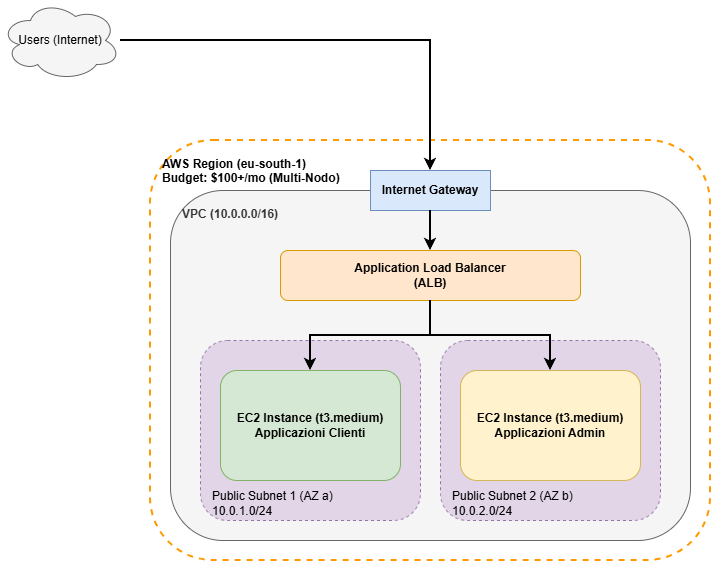

# CPIAC Scalamarket


Benvenuti nel repository del progetto **Scalamarket**. Questa guida fornisce le istruzioni per avviare il progetto localmente (fase di sviluppo/test) e per effettuare il deployment in cloud su AWS tramite Terraform.

---

## 1. Guida all'Avvio in Locale (Kubernetes)

Il progetto può essere avviato in un cluster Kubernetes locale (come Minikube o Docker Desktop) in due modalità: **Barebone** (senza ridondanza) e **Scalabile** (con Ingress e repliche multiple).

### Avvio Barebone (Senza Ingress)
```bash
# 1. Build delle immagini Docker (dalla root del progetto)
docker build -t cpiac_frontend:v5 -f frontend/Dockerfile frontend/
docker build -t cpiac_auth:v5    -f microservices/auth_service/Dockerfile .
docker build -t cpiac_inventory:v5 -f microservices/inventory_service/Dockerfile .
docker build -t cpiac_order:v5   -f microservices/order_service/Dockerfile .

# 2. Deploy delle risorse
kubectl apply -f k8s/

# 3. Port-forward per accesso locale
kubectl port-forward svc/auth-service 5001:5001 &
kubectl port-forward svc/inventory-service 5002:5002 &
kubectl port-forward svc/order-service 5003:5003 &
```

### Avvio Scalabile (Con NGINX Ingress e Repliche)
```bash
# 1. Installa NGINX Ingress Controller
# (Su Minikube)
minikube addons enable ingress

# (Su altri cluster locali)
kubectl apply -f https://raw.githubusercontent.com/kubernetes/ingress-nginx/controller-v1.10.0/deploy/static/provider/cloud/deploy.yaml

# 2. Deploy delle risorse aggiornate
kubectl apply -f k8s/

# 3. Verifica Ingress
kubectl get ingress

# 4. (Su Minikube) Ottieni l'IP e naviga su tale IP dal browser
minikube ip
```

---

## 2. Guida all'Implementazione su AWS (Terraform)

Per automatizzare il provisioning in Cloud, l'infrastruttura è gestita tramite **Terraform**. 
La configurazione iniziale include:
- **Controllo dei costi (AWS Budget):** Seguendo le best practice, è impostato un budget mensile (100$), con allarme via email qualora le spese superino l'80% di questa soglia.
- **Application Load Balancer (ALB) con Path-Based Routing:** È configurato un ALB su due Subnet pubbliche in Availability Zone separate. Gestisce l'instradamento inviando le richieste destinate ai path `/admin` e `/inventory` verso l'istanza EC2 **Admin** (nella Subnet 2), e tutto il traffico rimanente verso l'istanza EC2 **Clienti** (nella Subnet 1).

Assicurati di aver configurato le tue credenziali AWS (`aws configure`) e di aver generato una chiave SSH locale (necessaria a Terraform per garantirti l'accesso remoto ai server). Se non hai già una chiave, puoi crearla con il seguente comando prima di procedere:
```bash
ssh-keygen -t rsa -b 4096 -f ~/.ssh/id_rsa
```

```bash
cd terraform/

# 1. Inizializza l'ambiente scaricando i provider AWS necessari
terraform init

# 2. Verifica l'Execution Plan (cosa verrà creato)
terraform plan

# 3. Applica i cambiamenti e crea l'infrastruttura su AWS
terraform apply
```

Al termine dell'esecuzione, verranno restituiti in output i due IP pubblici delle macchine e il \textbf{DNS Name} dell'Application Load Balancer.

**Come accedere all'applicazione e deployare i container:**
1. Collegati via SSH ai nodi EC2 utilizzando i seguenti comandi (gli IP sono quelli restituiti in output da Terraform):
   - **Nodo Clienti:** `ssh -i ~/.ssh/id_rsa ubuntu@35.152.250.65`
   - **Nodo Admin:** `ssh -i ~/.ssh/id_rsa ubuntu@18.102.241.139`
2. Esegui il clone selettivo (\textit{sparse-checkout}) per scaricare sul server solo il codice sorgente necessario alla build e al deploy (escludendo documentazione e terraform):
   ```bash
   git clone --no-checkout https://github.com/SimoneDeLucia/CPIAC_Scalamarket
   cd CPIAC_Scalamarket
   git sparse-checkout init --cone
   git sparse-checkout set frontend init-scripts microservices k8s
   git checkout main
   ```
3. Assicurandoti di essere all'interno della cartella clonata, esegui le build Docker e il deploy Kubernetes separato per competenza:

   **Sul Nodo Clienti:**
   Essendo i servizi distribuiti su due nodi indipendenti, il servizio ordini ha bisogno di conoscere l'indirizzo pubblico del bilanciatore per comunicare con l'inventario. (Nota: Se esegui il progetto in ambiente `--LOCAL`, questo step non è necessario in quanto i servizi comunicano tramite il DNS interno `http://inventory-service:5002`).
   Esegui questo comando sostituendo `URL_ALB` con l'indirizzo del tuo Load Balancer:
   ```bash
   sed -i "s|value: \"http://inventory-service:5002\"|value: \"http://scalamarket-alb-171741115.eu-south-1.elb.amazonaws.com/api/inventory\"|g" k8s/order-deployment.yaml
   ```

   Dopodiché esegui le build:
   ```bash
   sudo docker build -t cpiac_frontend:v5 -f frontend/Dockerfile frontend/
   sudo docker build -t cpiac_auth:v5    -f microservices/auth_service/Dockerfile .
   sudo docker build -t cpiac_order:v5   -f microservices/order_service/Dockerfile .

   # Esporta le immagini da Docker e importale in K3s (Containerd)
   sudo docker save cpiac_frontend:v5 cpiac_auth:v5 cpiac_order:v5 > clients_images.tar
   sudo k3s ctr images import clients_images.tar

   # Database (Locale al nodo o condiviso)
   sudo kubectl apply -f k8s/postgres-pv-pvc.yaml
   sudo kubectl apply -f k8s/postgres-configmap.yaml
   sudo kubectl apply -f k8s/postgres-deployment.yaml
   sudo kubectl apply -f k8s/postgres-service.yaml

   # Servizi Clienti e Ingress
   sudo kubectl apply -f k8s/frontend-deployment.yaml
   sudo kubectl apply -f k8s/frontend-service.yaml
   sudo kubectl apply -f k8s/auth-deployment.yaml
   sudo kubectl apply -f k8s/auth-service.yaml
   sudo kubectl apply -f k8s/order-deployment.yaml
   sudo kubectl apply -f k8s/order-service.yaml
   sudo kubectl apply -f k8s/ingress.yaml
   ```

   **Sul Nodo Admin:**
   ```bash
   sudo docker build -t cpiac_inventory:v5 -f microservices/inventory_service/Dockerfile .

   # Esporta le immagini da Docker e importale in K3s (Containerd)
   sudo docker save cpiac_inventory:v5 > admin_images.tar
   sudo k3s ctr images import admin_images.tar

   # Database (Locale al nodo o condiviso)
   sudo kubectl apply -f k8s/postgres-pv-pvc.yaml
   sudo kubectl apply -f k8s/postgres-configmap.yaml
   sudo kubectl apply -f k8s/postgres-deployment.yaml
   sudo kubectl apply -f k8s/postgres-service.yaml

   # Servizi Admin e Ingress
   sudo kubectl apply -f k8s/inventory-deployment.yaml
   sudo kubectl apply -f k8s/inventory-service.yaml
   sudo kubectl apply -f k8s/ingress.yaml
   ```
4. **Navigazione:** Apri il browser e vai all'indirizzo pubblico del Load Balancer: [http://scalamarket-alb-171741115.eu-south-1.elb.amazonaws.com](http://scalamarket-alb-171741115.eu-south-1.elb.amazonaws.com). L'ALB smisterà automaticamente il traffico al nodo corretto basandosi sull'URL richiesto.

---

## 3. Schemi Architetturali

### UML (Unified Modeling Language)

**Component Diagram (Microservizi e Ingress)**  


**Sequence Diagram (Flusso logistica e ordini)**  


**Use Case Diagram (Separazione dei poteri)**  


### Architettura AWS (Terraform)


### Kubernetes: Fase Barebone
```text
  [ Utente ]
      | (Port 8080)
+-----v-----+      +----------------+
|  Frontend |      |  PostgreSQL    |
| (1 Pod)   |      | (1 Pod + PVC)  |
+-----------+      +-------^--------+
      |                    |
+-----v--------------------v--------+
|         Service ClusterIP         |
+-----+----------------+------------+
      |                |
+-----v-----+    +-----v-----+
|   Auth    |    | Inventory |
| (1 Pod)   |    |  (1 Pod)  |
+-----------+    +-----------+
*(N.B.: L'Order Service si interfaccia nello stesso modo ai Service ClusterIP)*
```

### Kubernetes: Fase Scalabilità (con Ingress)
```text
      [ Utente Internet ]
              | HTTP (:80)
   +----------v-----------+
   |   NGINX Ingress      |
   |    (Routing URL)     |
   +--+----+---------+----+
      |    |         |
     /api /auth    /orders
    /      |         |
+---v--+ +-v---+  +--v---+
|Front | |Auth |  |Order |
| (x2) | |(x3) |  |(x3)  |
+------+ +--+--+  +--+---+
            |        |
        +---v--------v---+
        |  PostgreSQL    |
        | (1 Replica)    |
        +----------------+
```
