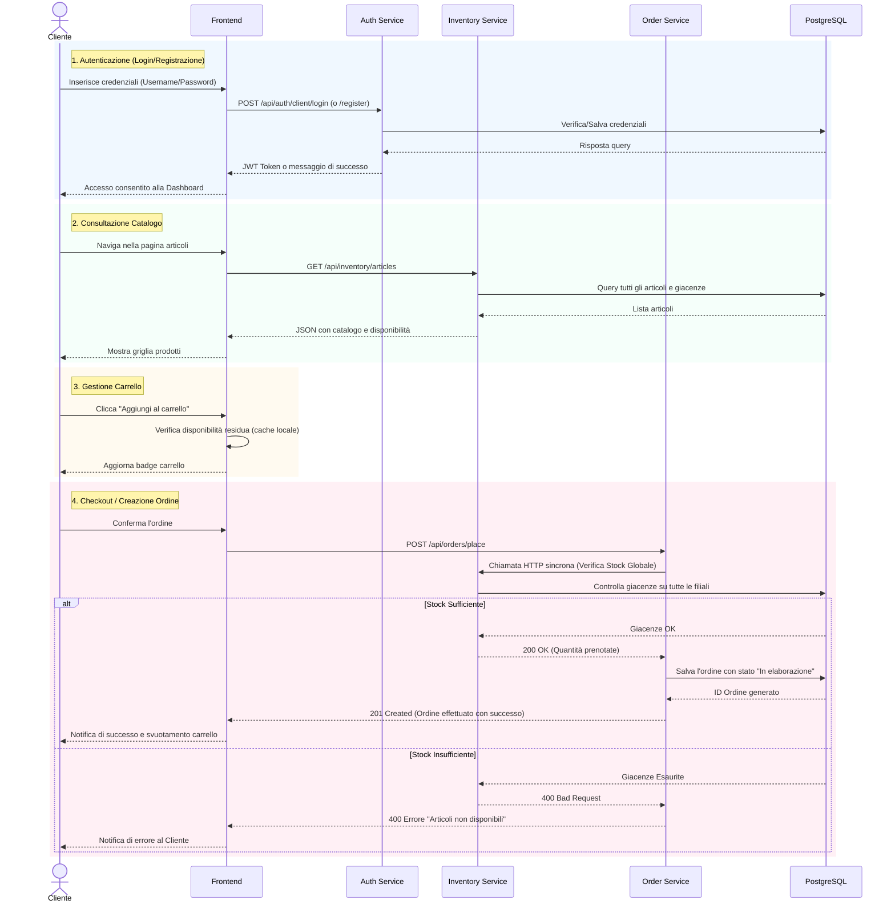
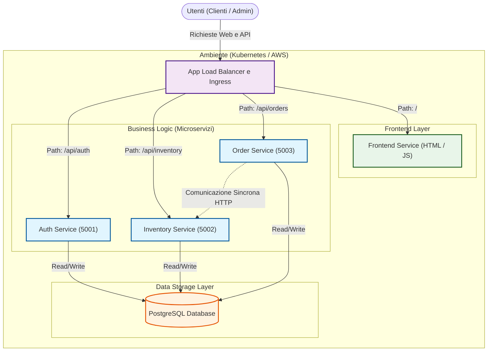
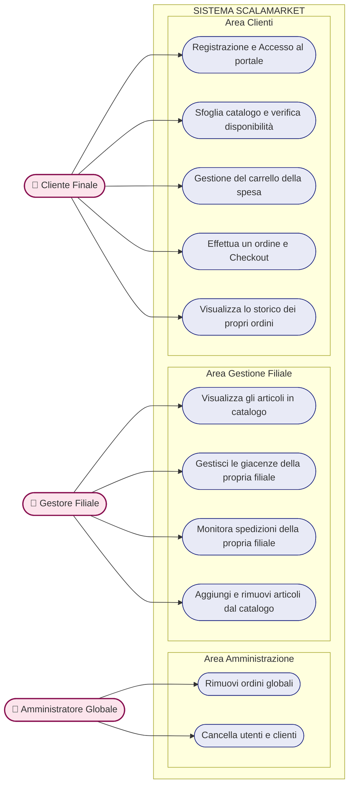

# Diagrammi UML in Mermaid

Di seguito i codici sorgente dei diagrammi realizzati in linguaggio **Mermaid.js**. Puoi visualizzarli direttamente qui, oppure copiarli su [Mermaid Live Editor](https://mermaid.live/) per scaricare le immagini PNG.

---

## 1. Sequence Diagram (Logistica e Ordini)

---

## 2. Component Diagram

---

## 3. Use Case Diagram
*Nota: Mermaid non ha diagrammi Use Case nativi, ma possiamo ottenerne una versione elegante e pulita tramite un flowchart LR.*

